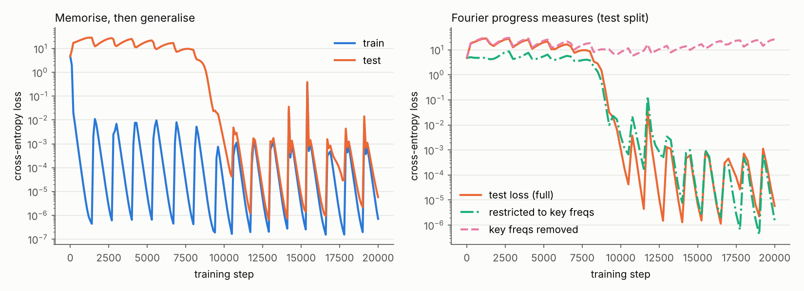

# tiny-circuits

Training small transformers from scratch on algorithmic tasks and taking them apart, on CPU.
Every claim below links to the evidence for it; failures and dead ends are in
[`notebook/LAB_NOTEBOOK.md`](notebook/LAB_NOTEBOOK.md).

**Status: Phase 1 (one seed, p=113) and Phase 2 (many seeds, small moduli) done on branch `phase2-seeds`.** Plan and pre-registered predictions: [`PLAN.md`](PLAN.md).



## Reproduce

```bash
pip install "jax[cpu]" numpy matplotlib optax
python -m tiny_circuits.train --p 113 --seed 0 --steps 20000 --ckpt_every 250 --out runs/p113_s0
#   (~40 min on 2 cores; add --max_seconds N and --resume to run in chunks. Resume is bit-exact.)
PYTHONPATH=. python scripts/phase1_analysis.py runs/p113_s0   # -> analysis.json, progress.json
PYTHONPATH=. python scripts/phase1_mechanism.py runs/p113_s0  # -> mechanism.json
PYTHONPATH=. python scripts/plot_phase1.py runs/p113_s0       # -> docs/phase1_progress.png
```

Model: 1 layer, 4 heads, d_model 128, d_mlp 512 (ReLU), no LayerNorm, learned positions, ~220k params.
Task: (a + b) mod 113, 30% of the 12,769 pairs for training, AdamW lr 1e-3, weight decay 1.0, full batch.

## Phase 1 claims (seed 0 only)

| # | Claim | Evidence | Confidence |
|---|-------|----------|------------|
| 1 | The model memorises, then groks. Train acc is 100% by step ~150; test acc is ~4% at step 4000, passes 50% at step 8600 and is 100% by step 10000. Weight norm falls from 58.8 (step 4000) to 37.2 (step 20000). | `runs/p113_s0/log.json` | High for this seed; not yet tested on others |
| 2 | The learned algorithm uses exactly four key frequencies, k ∈ {24, 28, 46, 56}. | Embedding Fourier norms for these are 7.7, 7.7, 6.8, 6.0; the next is 2.5 (k=1) then <0.7. 93% of embedding norm² is in these four. Logit energy that varies with the output class is concentrated on the (k,k) pairs of the same four (24: 39%, 46: 28%, 28: 5%, 56: 3.5%, plus a large class-dependent constant, 23%). `analysis.json` | High for this seed |
| 3 | These frequencies are *sufficient and necessary at the logit level*. Test loss with only the key components (plus the constant) is 1.6e-6, against 5.8e-6 for the full model. With them removed it is 26.5. Twenty random 4-frequency sets give restricted loss ≥ 25.8 and excluded loss ≤ 7.8e-6. | `analysis.json` (`loss_test`, `control_random_freqs_test`) | High that the logits are built from these components; this does not by itself show *how* the weights compute them |
| 4 | All four attention heads matter. Removing any one raises test loss from 6e-6 to between 2.9 and 4.1 (chance is 4.73). | `analysis.json` (`head_ablation_test_loss`); ablation zeroes the head's attention pattern, which is crude | Medium |
| 5 | MLP neurons fall into four groups by dominant frequency (133 / 102 / 143 / 134 neurons for k = 24 / 28 / 46 / 56). **Not supported:** that neurons are cleanly single-frequency. Median variance fraction explained by the dominant frequency is only 0.22 and no neuron exceeds 0.9, as expected for ReLU neurons with harmonics. | `analysis.json` (`neuron_*`) | Medium for the grouping; the "single-frequency" reading is not claimed |
| 6 | Training is bit-for-bit reproducible on one machine, including across the chunked resume: the interrupted run and the resumed run agree exactly on train and test loss at steps 2200 and 4000. | Lab notebook, 2026-10-03 | High on this machine; other hardware untested |
| 7 | The input and output sides use the same four frequencies. The top-4 Fourier frequencies of both `W_E` and `W_U` are {24, 28, 46, 56}. (80% of `W_U` norm² is in them, against 93% for `W_E`.) | `mechanism.json` | High for this seed |
| 8 | The heads specialise by frequency, in two near-duplicate pairs. Heads 0 and 2 write mostly k=46 (81% of key-frequency norm², with 13% on 28 and 6% on 56). Heads 1 and 3 write mostly k=24 (86%). This is what each head's value-output circuit *writes*, not proof of how the MLP uses it. | `mechanism.json` (`head_OV_frequency_content`) | Medium |
| 9 | Activation patching (3000 clean/corrupted pairs; metric = how often the *clean* answer comes back; chance 0.9%): no single head's clean output restores it (1–2%); all four heads restore 100%; patching all heads except one restores only ~32–34% whichever one is left out; patching all MLP activations restores 100%; patching only one frequency group of neurons restores 1.6–5.3%. So the answer is computed jointly from all four heads and all four neuron groups, not by any single sub-circuit. | `mechanism.json` (`activation_patching_clean_answer_accuracy`) | Medium |
| 10 | **Partly refuted, then partly explained.** The textbook form logit(c) ≈ Σₖ aₖcos(wₖ(a+b−c)) + bₖsin(wₖ(a+b−c)) + class bias explains R² = 0.82 of the logit variance but gets only 66.7% of decisions right. Adding every sign pattern at the key frequencies does not fix it (61.7%). The missing piece is on the output axis: components at harmonics and sums/differences of the key frequencies (2×24, 24±46, 3×24, …). Allowing 20 such frequencies lifts accuracy to 98.4%; 40 random sets of 20 non-key frequencies reach 80% on average (best 94%). **Exploratory** (the frequency list was chosen after seeing the spectrum). I have not shown how the network makes these terms. | `mechanism.json` (`trig_fit_*`), `trigfit_gap.json`, `trigfit_gap_control.json` (`scripts/phase1_trigfit_gap*.py`) | Medium that the simple form is incomplete; low-medium on the harmonic explanation |

## Phase 2 results (many seeds, p=53 / 45 / 47; branch `phase2-seeds`)

Setup differs from Phase 1: smaller moduli and more training data (50–60% instead of 30%) so that tens of seeds fit in a few
hours. Predictions were written down in `PLAN.md` before the results existed. Scorecard: **held:** Q1, Q2, Q3, Q5a–d; **failed:** Q4.
Most predictions were "nothing special happens", which is an easy bar; Q3 and Q4 were the real tests.

| # | Claim | Evidence | Confidence |
|---|-------|----------|------------|
| P1 | 29 of 30 seeds at p=53 reach ≥99% test accuracy (the 30th, seed 8, hovers at 98.9–99.3% and has a valid circuit). Every grokked seed uses 3–5 key frequencies (6 seeds with 3, 18 with 4, 5 with 5). | `runs/sweep_p53/summary_main.json`, `compare_main.json` | High |
| P2 | In every grokked seed the key frequencies carry the computation: test loss using only them (plus the constant term) is ≤ 3e-4 (worst restricted/full ratio 1.004), removing them gives loss ≥ 8.2, and random frequency sets of the same size fail (restricted ≥ 7.1). | same + `compare_*.json` (`validity`) | High |
| P3 | Which frequencies a seed picks is indistinguishable from a random draw. The most common frequency (9) appears in 9 of 29 seeds, against a null mean of 8.6 for the maximum (p = 0.50). Mean pairwise overlap 0.087 vs 0.091 under the null (p = 0.80), and no two seeds share the same set. Same at 0.5% and 2% thresholds. | `compare_main/f005/f02.json` | Medium: absence of evidence at n=29, not proof of uniformity |
| P4 | The frequencies are largely settled within the first ~100 steps, while the model still scores near chance on the test set. Taking the top-n embedding frequencies at the last checkpoint with test accuracy < 20% (median step 100), mean Jaccard overlap with the final set is 0.75 (chance 0.09; 86% of seeds above 0.5). By step 50 it is 0.55. It keeps creeping up to 0.93 at step 1500. | `runs/sweep_p53/q3.json` | Medium-high; n is taken from the final model, and the by-step curve is post hoc |
| P5 | Composite vs prime modulus (p=45 vs p=47, 24 seeds each): no detected difference. 3–5 key frequencies at both; at p=45 45.6% of key frequencies share a factor with 45 vs 45.4% expected by chance (p = 1.0); mean number of key frequencies 3.75 vs 3.78. A placebo on p=47 did not fire (p = 0.13). | `runs/q5.json`, `runs/sweep_p45/summary_main.json`, `runs/sweep_p47/summary_main.json` | Low-medium: ~90 draws can only detect a ~10-point shift, and p=45 is small |
| P6 | Training is bit-for-bit deterministic on this machine: independent reruns match the original weights exactly in 30/30 seeds (step 1500) and in 3/3 full 6000-step retrainings (seeds 0, 8, 17). | Lab notebook (C2, Q3) | High on this machine |
| P7 | **Failed prediction:** head duplication as in Phase 1 does not hold up. I predicted that in most seeds two heads would write the same dominant frequency with ≥50% share each; that is true in only 13 of 29 seeds. The looser statement ("two heads share a dominant frequency", 28/29) is almost guaranteed by pigeonhole (4 heads, 3–5 frequencies; chance alone gives ~26/29), so I don't claim it. | `compare_main.json` (`Q4`) | High that the strict version fails |

Caveats that apply to everything here: one architecture; small moduli; the key-frequency definition (a frequency pair holding ≥1% of the class-varying
logit energy) is mine; "no difference" results are limited by the number of seeds.

## Not done yet (in the Phase 1 plan)

- **Why claim 10 fails** is now partly answered (see its row) but the mechanism behind the harmonic terms is untested.
- **Weight-level circuit.** Claim 3 is about the logits. I have not shown, from the weights alone, how the MLP produces the key-frequency terms.
- **Seeds.** Everything is one seed. Seed universality is the first Phase 2 experiment.
- **Observed, not investigated:** training loss shows regular sharp spikes every ~1.4k steps (visible in the figure, left panel).

## What I would do next

1. Explain *how* the MLP makes the harmonic and combination terms behind claim 10 (a weight-level test, not another fit).
2. Repeat the seed sweep at p=113 / 30% data (hours per seed) to check that the small-modulus findings transfer.
3. The original Phase 2 ideas not yet touched: non-abelian groups (S5), two algorithms competing, two tasks sharing a network.

## Layout

```
tiny_circuits/   model.py (JAX transformer), data.py, train.py, analysis.py (Fourier toolkit)
scripts/         phase1_*.py, plot_phase1.py, sweep.py, phase2_analysis.py, phase2_compare.py, phase2_q3.py, phase2_q5.py
PLAN.md          Phase 2 plan, pre-registered predictions, addendum
runs/p113_s0/    config, training log, final weights, analysis + progress-measure JSON
notebook/        LAB_NOTEBOOK.md
```

Per-checkpoint weights (`ckpt_*.npz`, `state.pkl`) are not committed; rerun training to regenerate them.
